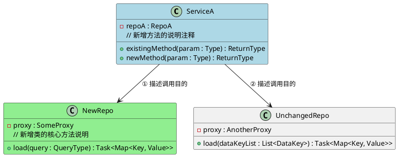

# 类图绘制规范（PlantUML）

需求开发中的核心类图使用 PlantUML **Class Diagram** 语法。

---

## 基础框架



---

## 颜色规范

| 颜色 | 语法 | 含义 |
|------|------|------|
| 蓝色 | `class Foo #lightblue` | **修改的已有类**（有字段或方法变更） |
| 绿色 | `class Foo #lightgreen` | **新增类** |
| 无色 | `class Foo` | 未变动的已有类（仅作依赖引用） |

---

## 绘制范围

**只画 Repository 层及以上**（Service、Interactor、Repository），不画：
- `Proxy` / `Client`（外部调用封装）
- `BO` / `DTO` / `Value Object`（数据对象，除非是核心领域对象）
- `package` 声明（不写包路径）

**画什么：**
- 本次需求新增的类 ✅
- 本次需求修改的类 ✅
- 作为依赖出现但本身未变更的关键类 ✅（无颜色）
- 与本次需求无关的类 ❌

---

## 字段与方法规范

### 可见性
| 符号 | 含义 |
|------|------|
| `+` | public |
| `-` | private |
| `#` | protected |

### 字段格式
```
- fieldName : FieldType
```

### 方法格式
```
+ methodName(paramName : ParamType) : ReturnType
```

多参数换行对齐（参数超过 2 个时）：
```
+ load(dataKeyList : List<CsuDataKey>,\n  userValue : UserValue)\n  : Task<Map<CsuDataKey, CsuEntity>>
```

### 新增方法注释
**对所有新增的方法**，在方法下方紧跟 `//` 注释说明其用途：

```plantuml
class FooRepository #lightblue {
    + existingMethod() : void
    + newlyAddedMethod(query : Query) : Task<Result>
    // 新增：说明这个方法做什么
}
```

---

## 分隔线（可选）

类内容较多时可用 `..` 分隔区域：

```plantuml
class FooService #lightblue {
    - repoA : RepoA
    - repoB : RepoB
    .. 核心方法 ..
    + mainMethod() : void
    .. 私有方法 ..
    - helperMethod() : void
}
```

---

## 关系规范

| 语法 | 含义 |
|------|------|
| `A --> B : ① 说明` | A 依赖 B（字段注入），用编号标注调用顺序和目的 |
| `A --|> B` | A 继承 B |
| `A ..|> B` | A 实现接口 B |

**关系标注格式**：`编号 + 动词短语`，描述调用目的而非调用方式：

```plantuml
CsuComparePriceValueRepository --> CsuBasicInfoRepository      : ① 查询 CSU 类目信息
CsuComparePriceValueRepository --> AggreUnitDetailRepository   : ② 查询平台 SKU 格子
CsuComparePriceValueRepository --> DemandCellGoodsRepository   : ③ 查各卖区最低价 CSU
CsuComparePriceValueRepository --> CsuEntityRepository         : ④ 加载 CsuEntity
```

---

## DDD 分层约定

类图遵循以下分层，依赖方向从上到下：

```
Interactor（用例层）
    ↓
Repository（仓储层）   ← 主要画这两层
    ↓
Proxy / Gateway（防腐层，不画入图）
```

- **Interactor**：编排多个 Repository，实现业务用例
- **Repository**：聚合多个数据来源，返回领域对象
- Repository 之间可以互相依赖（如 `CsuEntityRepository` 依赖 `CsuBasicInfoRepository`）

---

## 变更说明（图后附文字）

PlantUML 类图不支持行内标注「哪些是新增的」，在图后附文字说明：

```markdown
**变更说明**：
- `FooRepository`（蓝色）：已有类，新增 `newMethod()` 方法
- `BarRepository`（绿色）：新增类
- `BazRepository`（无色）：已有类，本次未改动，仅作依赖引用
```

---

## 文件命名

保存为 `05_classdiagram.puml`（PlantUML 文件后缀）
