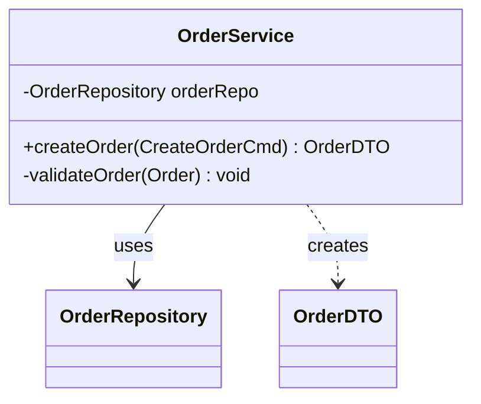
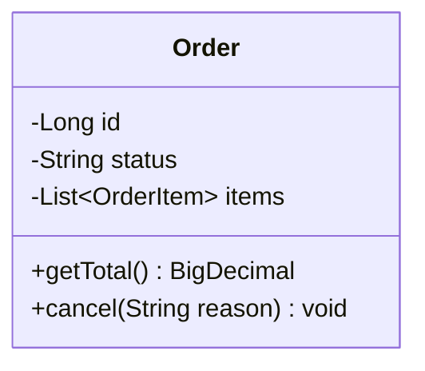
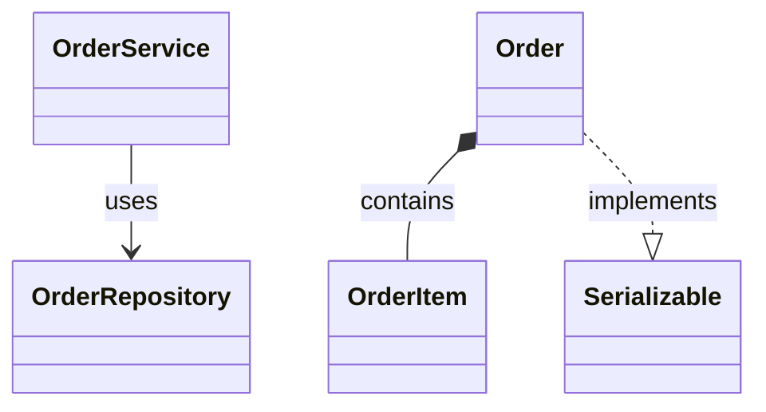
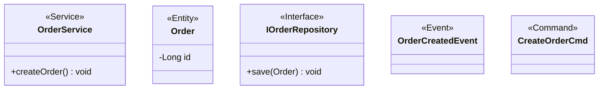
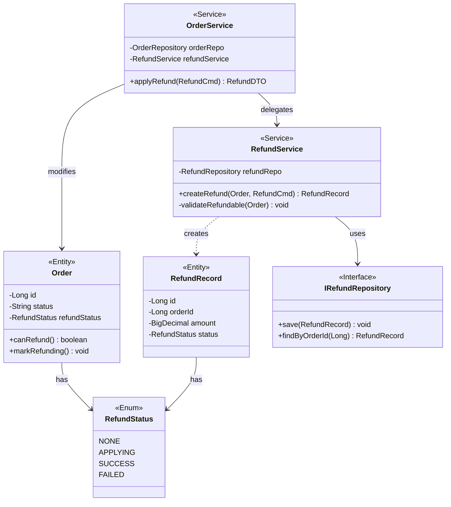

# 类图绘制规范

本规范适用于所有需求开发中的核心类图，使用 Mermaid `classDiagram` 语法。

---

## 基本格式



---

## 类的绘制规范

### 可见性修饰符

| 符号 | 含义 |
|------|------|
| `+` | public |
| `-` | private |
| `#` | protected |
| `~` | package/internal |

### 字段和方法格式

```
字段：{可见性}{字段名} {类型}
方法：{可见性}{方法名}({参数类型}) {返回类型}
```

**示例**：


### 泛型写法

使用 `~` 代替 `<>`：`List~String~`、`Map~String, Object~`

---

## 关系类型规范

| 关系 | 语法 | 含义 | 使用场景 |
|------|------|------|---------|
| 继承 | `A --|> B` | A 继承 B | extends |
| 实现 | `A ..|> B` | A 实现 B | implements |
| 组合 | `A *-- B` | A 包含 B（强依赖，A 销毁则 B 销毁） | 订单包含订单项 |
| 聚合 | `A o-- B` | A 包含 B（弱依赖，独立生命周期） | 部门包含员工 |
| 关联 | `A --> B` | A 使用 B（字段依赖） | Service 依赖 Repository |
| 依赖 | `A ..> B` | A 临时使用 B（方法参数/返回值） | 方法参数或返回值类型 |

**关系标注**：


---

## 分层规范

按职责分层绘制，通常分为：

```
Controller 层（API入口）
    ↓
Service 层（业务逻辑）
    ↓
Repository 层（数据访问）
    ↓
Domain/Model 层（领域对象）
```

**复杂需求建议分图绘制**，每张图聚焦一层或一个领域模块。

---

## 注解规范

使用 `<<注解>>` 标注类的角色：



常用注解：`<<Service>>`、`<<Entity>>`、`<<Interface>>`、`<<Repository>>`、`<<Event>>`、`<<Command>>`、`<<DTO>>`、`<<Enum>>`

---

## 粒度规范

- **只画变更相关的类**：新增的类 + 被修改的类 + 关键依赖类（不要把整个系统都画进去）
- **字段只列关键字段**：不需要 getter/setter，不需要所有字段，聚焦业务相关的
- **方法只列业务方法**：不需要 toString/equals/hashCode 等通用方法
- 单张图类数量建议 **3~10 个**，超过 10 个考虑拆分

---

## 必须包含的内容

1. **所有新增的类**（含类型注解）
2. **被修改的已有类**（标注哪些是已有字段/方法，哪些是新增的）
3. **核心接口**（如 Repository 接口、事件接口）
4. **关键枚举**（状态枚举、类型枚举）
5. **类间关系**（继承、实现、依赖关系）

---

## 标注已有 vs 新增

在注释中说明（Mermaid 不支持直接标注，在图后用文字说明）：

```markdown
**变更说明**：
- `Order`：已有类，新增 `refundStatus` 字段和 `applyRefund()` 方法
- `RefundService`：新增类
- `RefundRecord`：新增实体类
```

---

## 示例：订单退款功能类图



**变更说明**：
- `Order`：已有类，新增 `refundStatus` 字段、`canRefund()` 和 `markRefunding()` 方法
- `RefundService`：新增类
- `RefundRecord`：新增实体类
- `RefundStatus`：新增枚举
- `IRefundRepository`：新增接口
