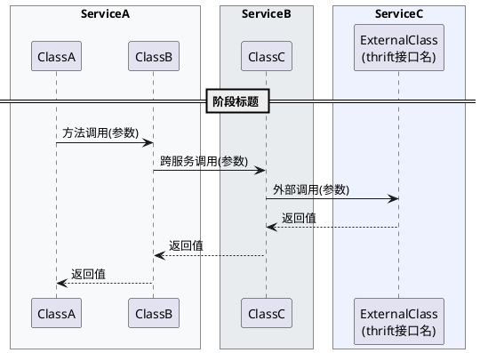

# 流程图绘制规范（PlantUML 时序图）

需求开发中的执行流程图使用 PlantUML **Sequence Diagram** 语法。

---

## 基础框架



---

## 参与者规范

### box 分组
- **一个 box = 一个服务**，box 名称写服务的实际名称（如 sales-shelf、gtq、cspu）
- 同一服务的所有参与者放在同一个 box 内
- 有几个服务就画几个 box，不按「内部/外部」分，按**服务边界**分
- 颜色用于区分不同服务，依次使用：`#F8F9FA` `#E9ECEF` `#EEF2FF` `#FFF3E0`

### 参与者命名
- 显示名：类名（如涉及多行可加换行 `\n` 标注 thrift 服务名 / 包名）
- 别名（`as`）：简短英文，方便引用

```plantuml
participant "TGoodsTradeQueryService\n(gtq)" as GTQ
participant "TAggreUnitService\n(cspu)" as CSPU
```

---

## 消息类型

| 语法 | 含义 | 使用场景 |
|------|------|---------|
| `A -> B : 方法名(参数)` | 同步调用 | 本地方法调用、RPC 调用 |
| `B --> A : 返回值` | 返回 | 所有返回值用虚线箭头 |
| `A -> A : 内部操作` | 自调用 | 读取配置、内部计算、Lion 开关 |
| `A ->> B : 发消息` | 异步 | MQ 发送等 |

---

## 分支与条件

使用 `alt / else / end` 表示分支，**每个分支必须写清楚条件**：

```plantuml
alt 开关关闭
    note over A: 走老链路

else 开关打开
    A -> B : 调用新逻辑()

    alt 调用失败 / 降级
        B --> A : 异常 / 空结果
        note over A #FFE4E1: 降级：回退处理

    else 调用成功
        B --> A : 正常结果
    end

end
```

**降级/异常路径**：note 背景色使用 `#FFE4E1`（淡红），文字前缀「降级：」

---

## 阶段分隔

用 `== 阶段名称 ==` 分隔主要逻辑阶段，每个阶段描述一个完整的业务动作：

```plantuml
== 判断开关 ==
== 查询基础信息 ==
== 执行核心逻辑 ==
== 公共收尾逻辑 ==
```

---

## Note 规范

| 场景 | 语法 |
|------|------|
| 说明调用背景/参数含义 | `note right: 说明文字` |
| 说明某参与者的状态/决策 | `note over A: 说明文字` |
| 标注降级/异常路径 | `note over A #FFE4E1: 降级：...` |
| 跨多个参与者的说明 | `note over A, B: 说明文字` |

---

## 必须包含的内容

1. **所有 Lion 开关判断**（用 `alt` 表达，并说明开关名）
2. **所有外部服务调用**（含服务名和接口名）
3. **所有降级路径**（note 标红）
4. **返回值类型**（`-->` 箭头后注明返回的类型/内容）
5. **阶段分隔**（至少按主要业务阶段分）

---

## skinparam 固定配置

每个流程图开头统一使用：

```plantuml
skinparam ParticipantPadding 20
skinparam BoxPadding 10
```

---

## 文件命名

保存为 `04_flowchart.puml`（PlantUML 文件后缀）
