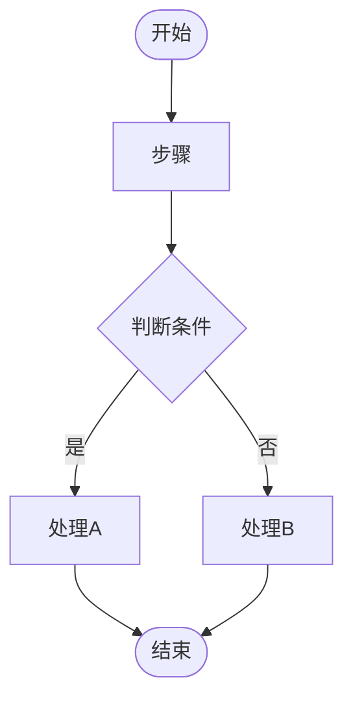
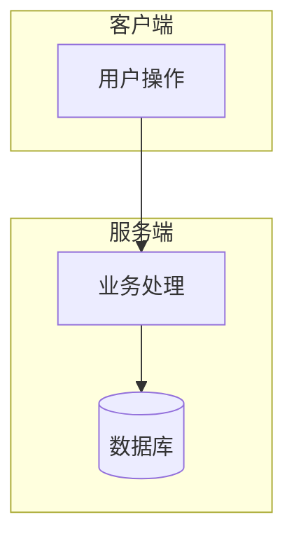
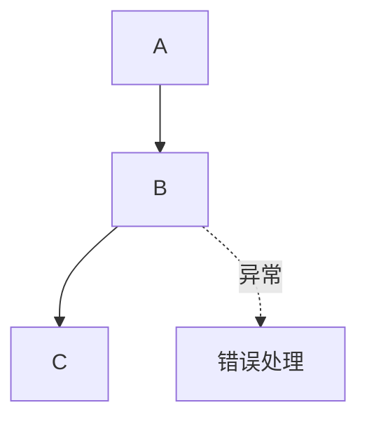
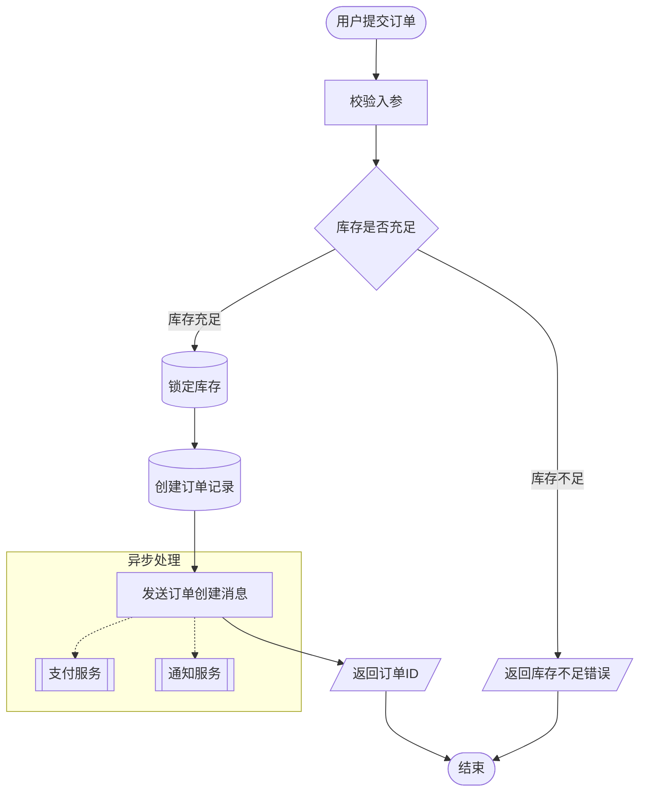

# 流程图绘制规范

本规范适用于所有需求开发中的执行流程图，使用 Mermaid `flowchart` 语法。

---

## 基本格式

---

## 节点形状规范

| 形状 | 语法 | 用途 |
|------|------|------|
| 圆角矩形 | `A([文字])` | 开始/结束节点 |
| 矩形 | `A[文字]` | 普通处理步骤 |
| 菱形 | `A{文字}` | 条件判断/分支 |
| 平行四边形 | `A[/文字/]` | 输入/输出 |
| 圆柱 | `A[(文字)]` | 数据库/存储操作 |
| 矩形（双线） | `A[[文字]]` | 子流程调用 |
| 六边形 | `A{{文字}}` | 准备/配置步骤 |

---

## 连线规范

| 连线 | 语法 | 用途 |
|------|------|------|
| 普通流转 | `A --> B` | 默认流程方向 |
| 带标签流转 | `A -->|标签| B` | 条件分支标签（如：是/否、成功/失败） |
| 异步/消息 | `A -.-> B` | 异步调用、消息队列 |
| 双向依赖 | `A <--> B` | 慎用，仅在真正双向时使用 |

---

## 颜色/样式规范

**子系统用 subgraph 区分**：

**关键路径高亮**（主流程使用默认样式，异常/旁路使用虚线）：

---

## 命名规范

- 节点 ID 使用有意义的英文缩写（如 `validateInput`，不要用 `A1`、`node123`）
- 节点文字简洁，不超过 15 个字
- 条件分支标签使用「是/否」或具体条件值（如「库存充足/库存不足」）

---

## 粒度规范

- **主流程图**：覆盖完整业务流程，每个节点代表一个业务操作（不是代码行）
- **详细流程图**（可选）：针对复杂子流程单独展开
- 单张图节点数量建议 **5~15 个**，超过 15 个考虑拆分子图

---

## 必须包含的内容

1. **开始和结束节点**（圆角矩形）
2. **所有主要异常/错误处理路径**（虚线标注）
3. **外部系统交互**（用 subgraph 区分系统边界）
4. **数据库/存储操作**（圆柱形节点）
5. **关键判断条件**（菱形节点，标注清楚判断依据）

---

## 示例：订单创建流程

